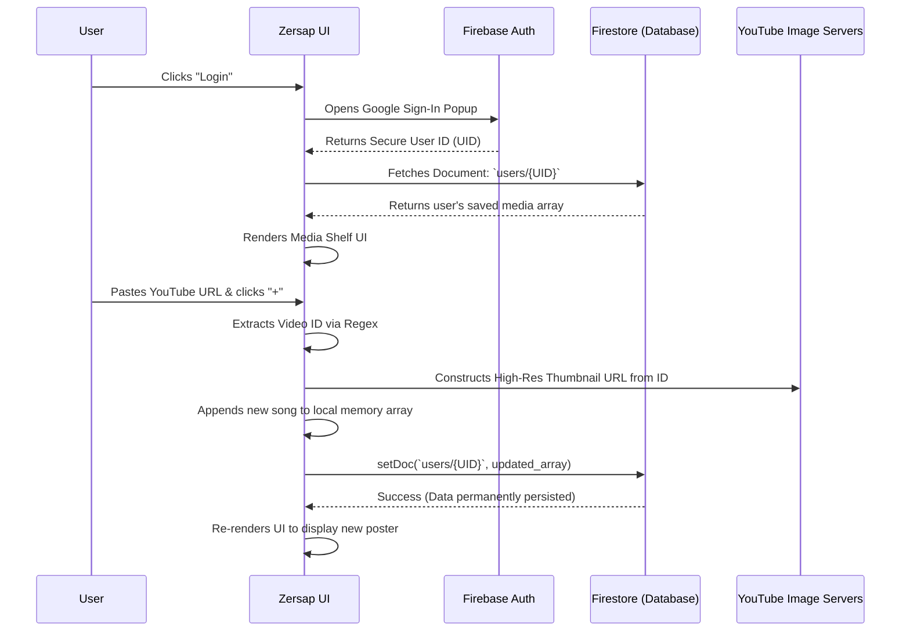

# Zersap - The Multi-User Media Diary

Zersap is a deeply personal, brutalist-style digital diary for your media consumption. Stop losing track of that incredible song you found on YouTube at 3 AM. With Zersap, you simply paste a YouTube link, and it automatically extracts the video data, saves the thumbnail, and pins it to your private, infinite-scrolling shelf.

Built with a "manga-pop" neo-brutalist aesthetic, Zersap is completely serverless. It uses Google Firebase to give every user their own secure, isolated media shelf. 

---

## ✨ Features

- **Google Authentication:** Passwordless sign-in. Your data is locked to your Google account.
- **Isolated User Shelves:** You and your friends can use the same website, but you will never see each other's data. Everyone gets their own blank canvas.
- **Smart Title Extraction:** Paste a YouTube URL and Zersap automatically fetches the high-res thumbnail, cleans up the messy YouTube title (removing tags like `[4K]` or `| Official Video`), and categorizes it.
- **Infinite Drag & Drop:** Rearrange your media shelf by literally dragging and dropping the posters. 
- **Neo-Brutalist Aesthetic:** High-contrast borders, raw typography, and smooth micro-animations. 

---

## 🛠 Workflow (How it Works)

### The Human Workflow (Non-Technical)
1. **Visit the Site:** You open Zersap. It prompts you to sign in.
2. **Login:** You click the "LOGIN" button and authenticate with your Google account.
3. **Your Diary Opens:** Zersap instantly retrieves your personal list of saved songs and renders them as beautiful vertical posters.
4. **Add a Memory:** You paste a YouTube link into the input box and press `+`.
5. **Instant Save:** The song pops onto your shelf. Behind the scenes, it's permanently saved to the cloud. You can safely close the tab without worrying about losing data.

### The Tech Stack Workflow
Zersap is built purely with **Vanilla JavaScript + HTML/CSS** for maximum performance, and uses **Google Firebase** for the backend infrastructure. 

---

## 🚀 Future Roadmap: Anime & Movies

Zersap is currently fully optimized for **Music**, but the foundation is laid out for **Movies** and **Anime** integration.

**Upcoming Implementations:**
1. **Dynamic Tab Switching:** Clicking the currently greyed-out "MOVIES" or "ANIME" tabs in the header will switch the active shelf, loading a completely different array from your Firebase database document.
2. **TMDB / Jikan API Integration:** While the Music tab relies on YouTube URLs, the upcoming tabs will integrate directly with external APIs (like The Movie Database and Jikan for MyAnimeList). You'll be able to type in a movie name, and Zersap will auto-fetch the official poster and synopsis.
3. **Watch Status:** Adding a visual indicator (like a small stamp or sticker on the poster) to denote "Watched" vs "Plan to Watch" for Movies and Anime.
